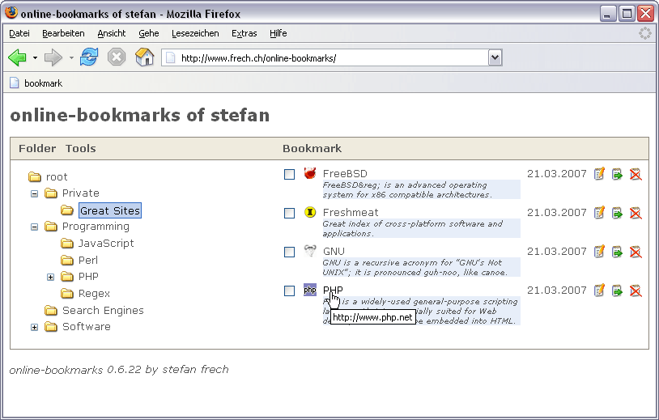
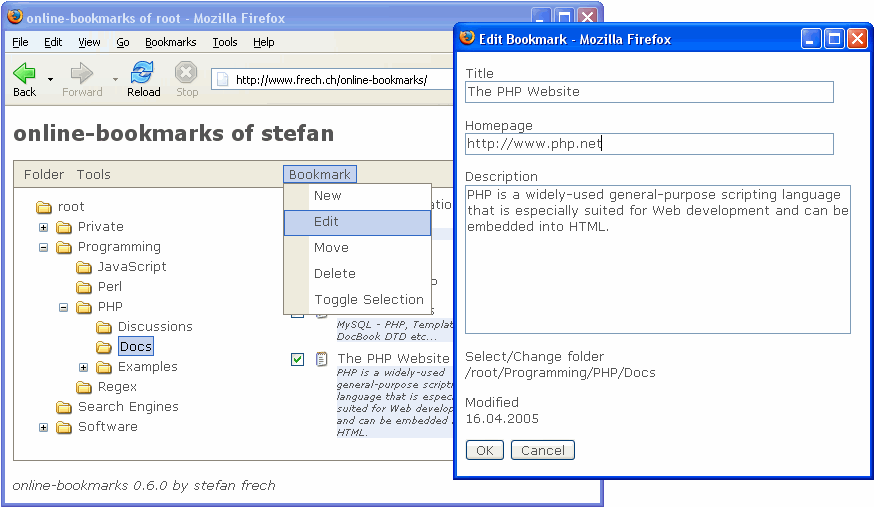
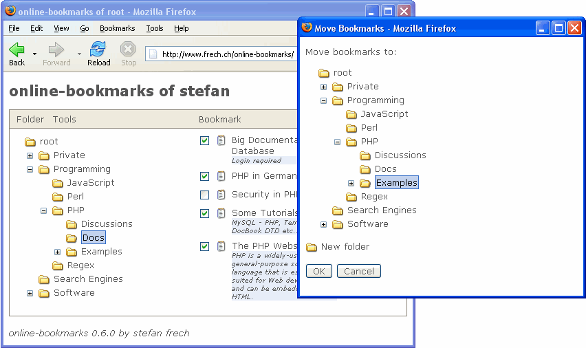
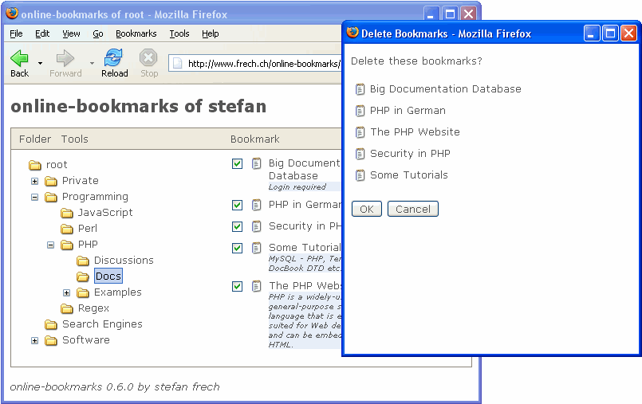
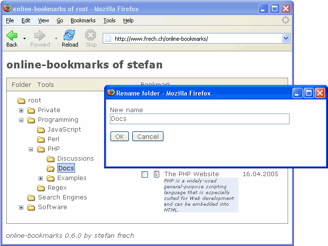

## online-bookmarks 0.8.15 beta  by Stefan Frech

### Description 

> With Online-Bookmarks you have the possibility to gain a multiuser Bookmark management system that keeps Bookmarks, Favorites and Links online, where they actually are needed. It makes it easy to store browser URL's central and access them from anywhere. Share site experiences with others in a social-bookmarking manner or keep your bookmarks private and safe as you like. It has never been easier to manage data properties at once, such as editing, moving, deleting or sharing. It is also possible to import/export Favorites from and to the most common browsers, such as Microsoft Internet Explorer, Mozilla, Opera and Netscape. Benefit from some nice addons that makes Online-Bookmarks really convenient.  
--- Source: https://www.hotscripts.com/listing/online-bookmarks/

### Download locations

#### On fossies.org (vers. 0.8.15 beta)

[website] https://fossies.org/linux/privat/online-bookmarks-0.8.15_beta.tar.gz/  
[files] https://fossies.org/linux/privat/online-bookmarks-0.8.15_beta.tar.gz ([tar.bz2](https://fossies.org/linux/privat/online-bookmarks-0.8.15_beta.tar.bz2) | [tar.xz](https://fossies.org/linux/privat/online-bookmarks-0.8.15_beta.tar.xz) | [zip](https://fossies.org/linux/privat/online-bookmarks-0.8.15_beta.zip))  
[archived file tar.gz] https://web.archive.org/web/20210102002557/https://raw.githubusercontent.com/anne-pm/online-bookmarks-0.8.15-beta-by-Stefan-Frech/main/online-bookmarks-0.8.15_beta.tar.gz  
[archived file tar.bz2] https://web.archive.org/web/20140806025811/http://fossies.org/linux/privat/online-bookmarks-0.8.15_beta.tar.bz2  
[archived file tar.xz] https://web.archive.org/web/20141021173038/http://fossies.org/linux/privat/online-bookmarks-0.8.15_beta.tar.xz  
[archived file zip] https://web.archive.org/web/20140806020449/http://fossies.org/linux/privat/online-bookmarks-0.8.15_beta.zip  

#### At the Internet Archive (vers. 0.8.14 beta)

[website] https://web.archive.org/web/20101231025234/http://frech.ch/online-bookmarks/download.php  
[directory] Index of /online-bookmarks/download 
https://web.archive.org/web/20101231035649/http://www.frech.ch/online-bookmarks/download/  
[file] https://web.archive.org/web/20101231035527/http://www.frech.ch/online-bookmarks/download/online-bookmarks-0.8.14_beta.tar.gz  

### Installation instructions

[website] https://web.archive.org/web/20080921225851/http://www.frech.ch/online-bookmarks/installation.php

### Screenshots

